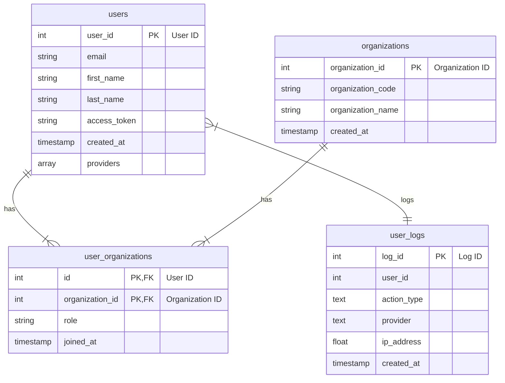

```mermaid
erDiagram
    users {
        int user_id PK "User ID"
        string email
        string first_name
        string last_name
        string access_token
        timestamp created_at
        array providers
    }

    organizations {
        int organization_id PK "Organization ID"
        string organization_code
        string organization_name
        timestamp created_at
    }

    user_logs {
        int log_id PK "Log ID"
        int user_id
        text action_type
        text provider
        float ip_address
        timestamp created_at
    }

    user_organizations {
        int id PK, FK "User ID"
        int organization_id PK, FK "Organization ID"
        string role
        timestamp joined_at
    }

    users ||--|{ user_organizations : "has"
    users }|--|| user_logs : "logs"
    organizations ||--|{ user_organizations : "has"
```