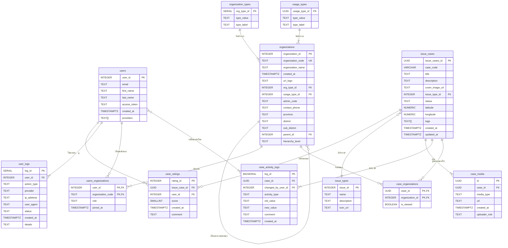

Entity-Relationship Diagram (ERD)
เอกสารนี้อธิบายโครงสร้างและความสัมพันธ์ของตารางต่างๆ ในฐานข้อมูลของโปรเจกต์

# ภาพรวมโปรเจกต์

โปรเจกต์นี้คือ API สำหรับระบบแจ้งและจัดการปัญหาภายในเมือง (City Data API) ที่ถูกพัฒนาขึ้นเพื่อเป็น Backend ให้กับแอปพลิเคชันสำหรับประชาชนและเจ้าหน้าที่ในการแจ้ง, ติดตาม, และจัดการปัญหาต่างๆ ที่เกิดขึ้นในพื้นที่ เช่น ปัญหาขยะ, ถนน, ไฟฟ้า, หรือประปา

## Workflow การทำงานหลัก

1.  **การแจ้งปัญหา (Issue Creation)**:
    *   ผู้ใช้ (ประชาชน) แจ้งปัญหาผ่านแอปพลิเคชัน โดยกรอกรายละเอียดต่างๆ เช่น หัวข้อ, คำอธิบาย, ประเภทปัญหา, และพิกัดที่ตั้ง
    *   API (`/api/cases/issue_cases`) จะรับข้อมูลนี้, สร้าง `case_code` ที่ไม่ซ้ำกัน, และบันทึกข้อมูลลงในตาราง `issue_cases`
    *   ระบบจะกำหนดสถานะเริ่มต้นของเคสเป็น "รอรับเรื่อง"
    *   หากมีการแนบไฟล์สื่อ (รูปภาพ, วิดีโอ), ข้อมูลจะถูกบันทึกใน `case_media`
    *   ประวัติการสร้างเคสจะถูกบันทึกใน `case_activity_logs`

2.  **การมอบหมายงานให้หน่วยงาน (Case Assignment)**:
    *   เมื่อเคสถูกสร้าง, ระบบจะมอบหมายเคสให้กับหน่วยงานที่เกี่ยวข้องโดยอัตโนมัติ (หรือโดย Admin)
    *   ข้อมูลการมอบหมายจะถูกบันทึกในตาราง `case_organizations` ซึ่งเชื่อมระหว่าง `issue_cases` และ `organizations`

3.  **เจ้าหน้าที่ตรวจสอบและรับเรื่อง (Case Viewing & Acknowledgment)**:
    *   เจ้าหน้าที่ของหน่วยงานล็อกอินเข้ามาในระบบและเห็นเคสที่ถูกมอบหมาย
    *   เมื่อเจ้าหน้าที่เปิดดูรายละเอียดเคส, API (`/api/cases/[id]/view`) จะถูกเรียกเพื่อบันทึกว่าเคสนี้มีเจ้าหน้าที่ดูแล้ว (`is_viewed = true`)
    *   หากสถานะเคสยังเป็น "รอรับเรื่อง", ระบบจะอัปเดตสถานะเป็น "กำลังประสานงาน" และบันทึกประวัติใน `case_activity_logs`

4.  **การดำเนินการแก้ไข (Case Processing)**:
    *   เจ้าหน้าที่สามารถอัปเดตสถานะของเคสได้ (เช่น "กำลังดำเนินการ", "เสร็จสิ้น", "ส่งต่อ") ผ่าน API (`/api/crud_case_detail`)
    *   ทุกครั้งที่มีการเปลี่ยนแปลงสถานะ, ข้อมูลจะถูกบันทึกใน `case_activity_logs` เพื่อให้สามารถติดตามประวัติได้

5.  **การให้คะแนนความพึงพอใจ (Rating)**:
    *   หลังจากเคสมีสถานะ "เสร็จสิ้น", ผู้แจ้งสามารถให้คะแนนความพึงพอใจ (1-5 ดาว) และแสดงความคิดเห็นได้
    *   API (`/api/score`) จะรับข้อมูลนี้และบันทึกลงในตาราง `case_ratings`

6.  **การดูสถิติและแดชบอร์ด (Statistics & Dashboard)**:
    *   เจ้าหน้าที่ระดับสูงหรือผู้ดูแลระบบสามารถดูสถิติต่างๆ ผ่าน API ในกลุ่ม `/api/stats/` เช่น:
        *   `overview`: จำนวนเคสในแต่ละสถานะ
        *   `count-by-type`: จำนวนเคสแยกตามประเภทปัญหา
        *   `overall-rating`: คะแนนความพึงพอใจโดยรวม
        *   `staff-activities`: กิจกรรมของเจ้าหน้าที่

# Entity-Relationship Diagram (ERD)
เอกสารนี้อธิบายโครงสร้างและความสัมพันธ์ของตารางต่างๆ ในฐานข้อมูลของโปรเจกต์

### คำอธิบายตาราง (Entities)

1.  **users**
    *   เก็บข้อมูลผู้ใช้งานในระบบ
    *   `user_id`: รหัสอ้างอิงหลักของผู้ใช้ (Primary Key)
    *   `email`: อีเมลของผู้ใช้
    *   `first_name`: ชื่อจริง
    *   `last_name`: นามสกุล
    *   `access_token`: Token ที่ใช้ในการยืนยันตัวตนผ่าน API
    *   `created_at`: วันและเวลาที่สร้างบัญชีผู้ใช้
    *   `providers`: รายชื่อช่องทางที่ใช้ในการสมัคร/ล็อกอิน (เช่น `['google', 'facebook']`)

2.  **organizations**
    *   เก็บข้อมูลหน่วยงานหรือองค์กร
    *   `organization_id`: รหัสอ้างอิงหลักของหน่วยงาน (Primary Key)
    *   `organization_code`: รหัสย่อของหน่วยงาน (Unique)
    *   `organization_name`: ชื่อเต็มของหน่วยงาน
    *   `created_at`: วันและเวลาที่สร้างหน่วยงาน
    *   `org_type_id`: FK อ้างอิงถึง `organization_types`
    *   `usage_type_id`: FK อ้างอิงถึง `usage_types`
    *   `parent_id`: FK อ้างอิงถึง `organizations` (สำหรับโครงสร้างแบบลำดับชั้น)
    *   `hierarchy_level`: ระดับของหน่วยงานในลำดับชั้น (เช่น 'Province', 'District')

3.  **user_logs**
    *   บันทึกกิจกรรม (logs) ทั้งหมดที่เกิดขึ้นจากผู้ใช้
    *   `log_id`: รหัสอ้างอิงหลักของ Log (Primary Key)
    *   `user_id`: FK อ้างอิงถึง `users`
    *   `action_type`: ประเภทของกิจกรรม (เช่น `LOGIN`, `LOGOUT`, `CREATE_TICKET`)
    *   `provider`: ช่องทางที่ผู้ใช้ล็อกอิน
    *   `ip_address`: IP Address ของผู้ใช้
    *   `created_at`: วันและเวลาที่เกิดกิจกรรม

4.  **users_organizations**
    *   ตารางเชื่อม (Junction Table) สำหรับความสัมพันธ์ Many-to-Many ระหว่าง `users` และ `organizations`
    *   `user_id`: FK อ้างอิงถึง `users` (Primary Key)
    *   `organization_code`: FK อ้างอิงถึง `organizations` (Primary Key)
    *   `role`: บทบาทของผู้ใช้ในหน่วยงาน (เช่น `admin`, `member`)
    *   `joined_at`: วันและเวลาที่ผู้ใช้เข้าร่วมหน่วยงาน

5.  **issue_cases**
    *   เก็บข้อมูลเคสหรือประเด็นปัญหา
    *   `issue_cases_id`: รหัสอ้างอิงหลักของเคส (Primary Key)
    *   `case_code`: รหัสของเคส
    *   `title`: หัวข้อของเคส
    *   `issue_type_id`: FK อ้างอิงถึง `issue_types`
    *   `status`: สถานะของเคส (เช่น `รอรับเรื่อง`, `กำลังดำเนินการ`)

6.  **case_activity_logs**
    *   เก็บประวัติการเปลี่ยนแปลงของแต่ละเคส
    *   `log_id`: รหัสอ้างอิงหลักของประวัติ (Primary Key)
    *   `case_id`: FK อ้างอิงถึง `issue_cases`
    *   `changed_by_user_id`: FK อ้างอิงถึง `users`
    *   `activity_type`: ประเภทของกิจกรรม (เช่น `STATUS_CHANGE`, `COMMENT`)
    *   `old_value`: ค่าเก่า
    *   `new_value`: ค่าใหม่
    *   `comment`: หมายเหตุเพิ่มเติม

7.  **case_ratings**
    *   เก็บข้อมูลการให้คะแนนความพึงพอใจต่อเคส
    *   `rating_id`: รหัสอ้างอิงหลัก (Primary Key)
    *   `issue_case_id`: FK อ้างอิงถึง `issue_cases`
    *   `user_id`: FK อ้างอิงถึง `users`
    *   `score`: คะแนน (1-5)
    *   `comment`: ความคิดเห็นเพิ่มเติม

