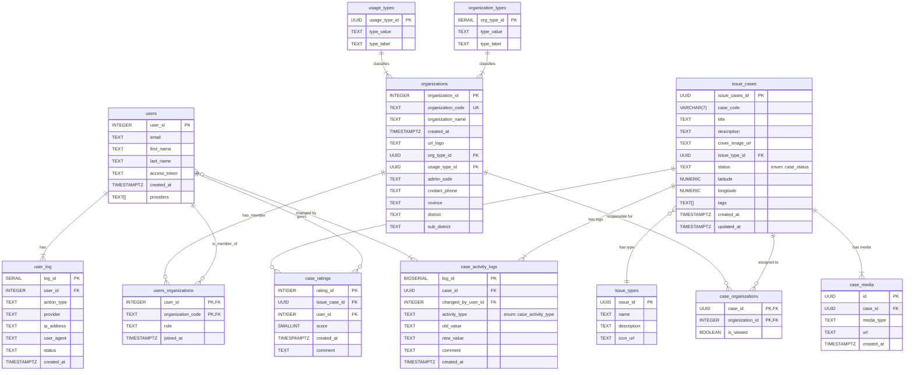

Entity-Relationship Diagram (ERD)
เอกสารนี้อธิบายโครงสร้างและความสัมพันธ์ของตารางต่างๆ ในฐานข้อมูลของโปรเจกต์

คำอธิบายตาราง (Entities)
1. users
ตารางสำหรับเก็บข้อมูลผู้ใช้งานในระบบ

id (PK): รหัสอ้างอิงหลักของผู้ใช้
email: อีเมลของผู้ใช้
first_name: ชื่อจริง
last_name: นามสกุล
access_token: Token ที่ใช้ในการยืนยันตัวตนผ่าน API
created_at: วันและเวลาที่สร้างบัญชีผู้ใช้
providers: รายชื่อช่องทางที่ใช้ในการสมัคร/ล็อกอิน (เช่น ['google', 'facebook' , 'line'])

2. organizations
ตารางสำหรับเก็บข้อมูลหน่วยงานหรือองค์กร

organization_id (PK): รหัสอ้างอิงหลักของหน่วยงาน
organization_code: รหัสย่อของหน่วยงาน
organization_name: ชื่อเต็มของหน่วยงาน
created_at: วันและเวลาที่สร้างหน่วยงาน

3. user_logs
ตารางสำหรับบันทึกกิจกรรม (logs) ทั้งหมดที่เกิดขึ้นจากผู้ใช้

log_id (PK): รหัสอ้างอิงหลักของ Log
user_id (FK): รหัสผู้ใช้ที่ก่อให้เกิดกิจกรรม (อ้างอิงถึง users.id)
action_type: ประเภทของกิจกรรม (เช่น login, logout, create_ticket)
provider: ช่องทางที่ผู้ใช้ล็อกอินเข้ามาในขณะนั้น
ip_address: IP Address ของผู้ใช้
created_at: วันและเวลาที่เกิดกิจกรรม

4. users_organizations
ตารางเชื่อม (Junction Table) สำหรับสร้างความสัมพันธ์แบบ Many-to-Many ระหว่าง users และ organizations

user_id (PK, FK): รหัสผู้ใช้ (อ้างอิงถึง users.id)
organization_id (PK, FK): รหัสหน่วยงาน (อ้างอิงถึง organizations.organization_id)
role: บทบาทของผู้ใช้ในหน่วยงานนั้นๆ (เช่น admin, member)
joined_at: วันและเวลาที่ผู้ใช้เข้าร่วมหน่วยงาน

ความสัมพันธ์ (Relationships)

ผู้ใช้ (users) กับ หน่วยงาน (organizations): เป็นความสัมพันธ์แบบ Many-to-Many ผู้ใช้ 1 คน สามารถสังกัดได้หลายหน่วยงาน หน่วยงาน 1 แห่ง สามารถมีผู้ใช้ได้หลายคน โดยมีความสัมพันธ์ผ่านตาราง users_organizations ซึ่งถ้ามีการ add user_id กับ organiation_id ก็จะดึงข้อมูลของ user และ organization เข้ามาในตาราง users_organizations 
ผู้ใช้ (users) กับ ล็อก (user_logs): เป็นความสัมพันธ์แบบ One-to-Many ผู้ใช้ 1 คน สามารถมีประวัติการใช้งาน (logs) ได้หลายรายการ แต่ log 1 รายการ จะเป็นของผู้ใช้เพียงคนเดียวเท่านั้น
